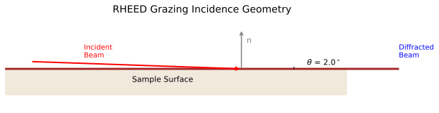
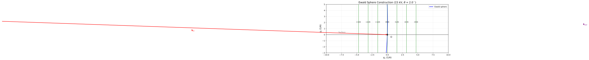

# Generating RHEED Patterns from Arbitrary Directions

RHEED patterns depend strongly on the crystallographic direction of the incident electron beam. This guide covers how to simulate RHEED from any azimuthal direction or surface orientation using rheedium.

## Beam Direction Parameters

The `kinematic_simulator` function accepts two angle parameters that control the beam direction:

| Parameter | Description | Typical Range |
|-----------|-------------|---------------|
| `theta_deg` | Grazing incidence angle (from surface plane) | 1-5 degrees |
| `phi_deg` | Azimuthal angle (in-plane rotation) | 0-360 degrees |

### Geometry Definition

The coordinate system is defined as:

- **x-axis**: Default beam direction when `phi_deg=0`
- **y-axis**: Perpendicular to beam, in the surface plane
- **z-axis**: Surface normal (pointing up)

```python
from rheedium.plots import plot_grazing_incidence_geometry
import matplotlib.pyplot as plt

fig, ax = plt.subplots(figsize=(14, 8))
plot_grazing_incidence_geometry(
    theta_deg=2.0,
    ax=ax,
)
plt.savefig("grazing_geometry.png", dpi=150, bbox_inches="tight")
plt.show()
```



The incident wavevector components are:

$$
\mathbf{k}_{in} = k \begin{pmatrix}
\cos\theta \cos\phi \\
\cos\theta \sin\phi \\
-\sin\theta
\end{pmatrix}
$$

where $k = 2\pi/\lambda$ is the wavevector magnitude.

## Azimuthal Rotation (phi_deg)

Rotating the azimuthal angle changes which crystallographic direction the beam is aligned with.

### Basic Usage

```python
import rheedium as rh

crystal = rh.inout.parse_cif("structure.cif")

# Beam along [100] direction (phi = 0)
pattern_100 = rh.simul.kinematic_simulator(
    crystal=crystal,
    voltage_kv=20.0,
    theta_deg=2.0,
    phi_deg=0.0,
)

# Beam along [110] direction (phi = 45 for cubic)
pattern_110 = rh.simul.kinematic_simulator(
    crystal=crystal,
    voltage_kv=20.0,
    theta_deg=2.0,
    phi_deg=45.0,
)

# Beam along [010] direction (phi = 90)
pattern_010 = rh.simul.kinematic_simulator(
    crystal=crystal,
    voltage_kv=20.0,
    theta_deg=2.0,
    phi_deg=90.0,
)
```

### Azimuthal Dependence

Different azimuths probe different in-plane periodicities:

| Azimuth | Cubic Crystal | Pattern Characteristics |
|---------|---------------|------------------------|
| 0 degrees | [100] | Vertical streaks from (h00) rods |
| 45 degrees | [110] | Denser pattern from (hh0) rods |
| 90 degrees | [010] | Same as 0 degrees (4-fold symmetry) |

### Azimuthal Scan

To study the full azimuthal dependence:

```python
import jax.numpy as jnp

# Scan azimuthal angle
phi_values = jnp.linspace(0, 90, 19)  # 0 to 90 in 5-degree steps

patterns = []
for phi in phi_values:
    pattern = rh.simul.kinematic_simulator(
        crystal=crystal,
        voltage_kv=20.0,
        theta_deg=2.0,
        phi_deg=float(phi),
    )
    patterns.append(pattern)
```

## Non-(001) Surface Orientations

For surfaces other than (001), you need to reorient the crystal so the desired surface normal is along z.

### Using bulk_to_slice

The `bulk_to_slice` function creates a surface slab with the specified Miller plane as the surface:

```python
from rheedium.types import bulk_to_slice
import jax.numpy as jnp

# Load bulk crystal
bulk = rh.inout.parse_cif("structure.cif")

# Create (111)-oriented surface
slab_111 = bulk_to_slice(
    bulk_crystal=bulk,
    orientation=jnp.array([1, 1, 1]),
    depth=30.0,  # Slab thickness in Angstroms
)

# Simulate RHEED from (111) surface
pattern_111 = rh.simul.kinematic_simulator(
    crystal=slab_111,
    voltage_kv=20.0,
    theta_deg=2.0,
    phi_deg=0.0,
)
```

### Common Surface Orientations

| Surface | Miller Indices | Typical Applications |
|---------|---------------|---------------------|
| (001) | [0, 0, 1] | Default, most common |
| (111) | [1, 1, 1] | Close-packed planes in FCC |
| (110) | [1, 1, 0] | Open surfaces |
| (011) | [0, 1, 1] | Equivalent to (110) in cubic |
| (112) | [1, 1, 2] | Vicinal/stepped surfaces |

### Example: (110) Surface

```python
# Create (110)-oriented surface slab
slab_110 = bulk_to_slice(
    bulk_crystal=bulk,
    orientation=jnp.array([1, 1, 0]),
    depth=25.0,
)

# RHEED along different azimuths on (110)
# phi=0 is along [001] in-plane direction
pattern_110_001 = rh.simul.kinematic_simulator(
    crystal=slab_110,
    voltage_kv=20.0,
    theta_deg=2.0,
    phi_deg=0.0,
)

# phi=90 is along [1-10] in-plane direction
pattern_110_1m10 = rh.simul.kinematic_simulator(
    crystal=slab_110,
    voltage_kv=20.0,
    theta_deg=2.0,
    phi_deg=90.0,
)
```

## Combining Surface Orientation and Azimuth

For complete control, combine surface reorientation with azimuthal rotation:

```python
import jax.numpy as jnp
from rheedium.types import bulk_to_slice

# 1. Create surface slab with desired orientation
bulk = rh.inout.parse_cif("SrTiO3.cif")
slab = bulk_to_slice(
    bulk_crystal=bulk,
    orientation=jnp.array([1, 1, 1]),  # (111) surface
    depth=20.0,
)

# 2. Simulate from multiple azimuths
azimuths = [0, 30, 60, 90]
patterns = {}

for phi in azimuths:
    patterns[phi] = rh.simul.kinematic_simulator(
        crystal=slab,
        voltage_kv=20.0,
        theta_deg=2.0,
        phi_deg=float(phi),
    )
```

## Grazing Angle Effects

The grazing angle `theta_deg` affects:

1. **Penetration depth**: Lower angles = more surface sensitive
2. **Ewald sphere intersection**: Changes which reflections are excited
3. **Pattern geometry**: Affects streak spacing and curvature

The Ewald sphere construction for RHEED geometry:

```python
from rheedium.plots import plot_ewald_sphere_2d
import matplotlib.pyplot as plt

fig, ax = plt.subplots(figsize=(12, 8))
plot_ewald_sphere_2d(
    voltage_kv=20.0,
    theta_deg=2.0,
    lattice_spacing=3.905,
    n_rods=9,
    ax=ax,
)
plt.savefig("ewald_sphere.png", dpi=150, bbox_inches="tight")
plt.show()
```



### Typical Values

| Material Type | Recommended theta_deg |
|--------------|----------------------|
| Metals | 1-2 degrees |
| Oxides | 2-3 degrees |
| Semiconductors | 2-4 degrees |

### Angle Scan

```python
# Study grazing angle dependence
theta_values = [1.0, 1.5, 2.0, 2.5, 3.0]

for theta in theta_values:
    pattern = rh.simul.kinematic_simulator(
        crystal=crystal,
        voltage_kv=20.0,
        theta_deg=theta,
        phi_deg=0.0,
    )
    rh.plots.plot_rheed(pattern)
```

## Visualization

The `plot_rheed` function renders the simulated pattern:

```python
# Default visualization with Gaussian spot broadening
rh.plots.plot_rheed(pattern)

# Customize appearance
rh.plots.plot_rheed(
    pattern,
    grid_size=400,           # Higher resolution
    spot_width=0.05,         # Sharper spots
    cmap_name="phosphor",    # Phosphor screen colormap
)
```

### Comparing Multiple Azimuths

```python
import matplotlib.pyplot as plt

fig, axes = plt.subplots(1, 3, figsize=(15, 6))

for ax, phi in zip(axes, [0, 45, 90]):
    pattern = rh.simul.kinematic_simulator(
        crystal=crystal,
        voltage_kv=20.0,
        theta_deg=2.0,
        phi_deg=phi,
    )
    # Use lower-level plotting for subplots
    coords = np.asarray(pattern.detector_points)
    intensities = np.asarray(pattern.intensities)
    ax.scatter(coords[:, 0], coords[:, 1], c=intensities, s=10)
    ax.set_title(f"phi = {phi} degrees")
    ax.set_xlabel("x_d (mm)")
    ax.set_ylabel("y_d (mm)")

plt.tight_layout()
plt.show()
```

## Physical Considerations

### Symmetry

The pattern symmetry depends on both surface and azimuth:

- **(001) surface, phi=0**: Pattern has vertical mirror plane
- **(001) surface, phi=45**: Different symmetry for [110] azimuth
- **(111) surface**: 3-fold or 6-fold symmetry depending on termination

### Zone Axis Alignment

For strong diffraction features, align the beam along a low-index zone axis:

| Surface | Strong Azimuths |
|---------|-----------------|
| (001) cubic | 0 degrees ([100]), 45 degrees ([110]) |
| (111) cubic | 0, 60, 120 degrees (equivalent) |
| (110) cubic | 0 degrees ([001]), 90 degrees ([1-10]) |

### Reconstruction Effects

Surface reconstructions change the in-plane periodicity:

```python
# For a 2x1 reconstruction, you might see:
# - Extra streaks at half-integer positions
# - Different intensity along different azimuths
#
# The simulation uses bulk-terminated positions;
# for reconstructions, modify the surface layer positions
# before simulation.
```

## Complete Workflow Example

```python
import rheedium as rh
import jax.numpy as jnp
from rheedium.types import bulk_to_slice, SurfaceConfig

# 1. Load structure
bulk = rh.inout.parse_cif("GaAs.cif")

# 2. Create (110) surface slab
slab = bulk_to_slice(
    bulk_crystal=bulk,
    orientation=jnp.array([1, 1, 0]),
    depth=25.0,
)

# 3. Configure surface atom identification
surface_config = SurfaceConfig(method="layers", n_layers=2)

# 4. Simulate RHEED along [001] azimuth
pattern = rh.simul.kinematic_simulator(
    crystal=slab,
    voltage_kv=15.0,
    theta_deg=2.5,
    phi_deg=0.0,  # [001] in-plane direction
    surface_config=surface_config,
    temperature=300.0,
    surface_roughness=0.5,
)

# 5. Visualize
rh.plots.plot_rheed(pattern, grid_size=300)
```

## Quick Reference

| Goal | Parameters |
|------|------------|
| Change beam azimuth | `phi_deg=45.0` |
| Change grazing angle | `theta_deg=2.5` |
| (111) surface | `bulk_to_slice(..., orientation=[1,1,1])` |
| (110) surface | `bulk_to_slice(..., orientation=[1,1,0])` |
| Azimuthal scan | Loop over `phi_deg` values |

## Key Source Files

- [`simul/simulator.py`](https://github.com/debangshu-mukherjee/rheedium/blob/main/src/rheedium/simul/simulator.py) - `kinematic_simulator` with angle parameters
- [`simul/simul_utils.py`](https://github.com/debangshu-mukherjee/rheedium/blob/main/src/rheedium/simul/simul_utils.py) - `incident_wavevector` calculation
- [`types/crystal_types.py`](https://github.com/debangshu-mukherjee/rheedium/blob/main/src/rheedium/types/crystal_types.py) - `bulk_to_slice` for surface reorientation
- [`plots/figuring.py`](https://github.com/debangshu-mukherjee/rheedium/blob/main/src/rheedium/plots/figuring.py) - `plot_rheed` visualization
