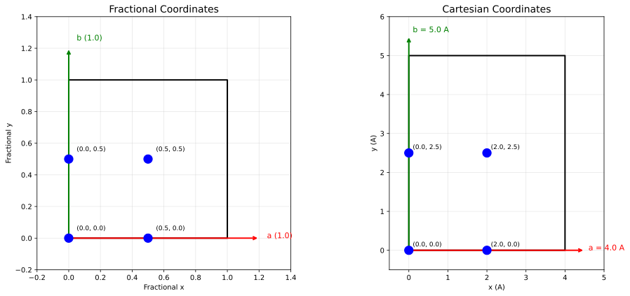

# Data Wrangling: XYZ and CIF Files

Rheedium supports multiple crystallographic file formats for input data. This guide covers parsing pipelines, coordinate transformations, and the data flow from files to simulation-ready structures.

## Supported Formats

| Format | Extension | Use Case | Key Features |
|--------|-----------|----------|--------------|
| XYZ | `.xyz` | Molecular dynamics, DFT output | Simple, widely supported |
| Extended XYZ | `.xyz` | ASE output, periodic systems | Lattice vectors, properties |
| CIF | `.cif` | Crystallography databases | Symmetry operations, space groups |
| POSCAR/CONTCAR | `POSCAR`, `CONTCAR` | VASP input/output | DFT calculations |

## XYZ File Format

### Standard XYZ

The basic XYZ format is minimal:

```
N
Comment line
Element1  x1  y1  z1
Element2  x2  y2  z2
...
```

Where:

- Line 1: Number of atoms $N$
- Line 2: Comment (often contains metadata)
- Lines 3+: Element symbol and Cartesian coordinates (Å)

### Extended XYZ (ASE Format)

The extended format embeds metadata in the comment line:

```
8
Lattice="5.43 0.0 0.0 0.0 5.43 0.0 0.0 0.0 5.43" Properties=species:S:1:pos:R:3 energy=-123.45
Si  0.000  0.000  0.000
Si  1.358  1.358  1.358
...
```

Recognized metadata fields:

| Field | Format | Description |
|-------|--------|-------------|
| `Lattice` | 9 space-separated floats | Lattice vectors as a flattened 3×3 matrix |
| `energy` | float | Total energy (eV) |
| `stress` | 9 floats | Stress tensor (eV/ų) |
| `Properties` | descriptor string | Column definitions |

### Parsing XYZ Files

```python
from rheedium.inout import parse_xyz

# Parse an XYZ file
xyz_data = parse_xyz("structure.xyz")

# Access atomic data
positions = xyz_data.positions      # Float[Array, "N 3"]
atomic_numbers = xyz_data.atomic_numbers  # Int[Array, "N"]

# Access optional metadata (may be None)
lattice = xyz_data.lattice          # Float[Array, "3 3"] or None
energy = xyz_data.energy            # float or None
```

### XYZData Structure

The `XYZData` PyTree contains:

```python
@register_pytree_node_class
class XYZData(NamedTuple):
    positions: Float[Array, "N 3"]        # Cartesian coordinates (Å)
    atomic_numbers: Int[Array, "N"]       # Atomic Z values
    lattice: Optional[Float[Array, "3 3"]]  # Lattice vectors (Å)
    stress: Optional[Float[Array, "3 3"]]   # Stress tensor
    energy: Optional[float]                 # Total energy
    properties: Optional[List[Dict]]        # Extended properties
    comment: Optional[str]                  # Raw comment line
```

## CIF File Format

CIF (Crystallographic Information File) is the standard for crystallographic databases.

### Key CIF Fields

```
data_SrTiO3
_cell_length_a    3.905
_cell_length_b    3.905
_cell_length_c    3.905
_cell_angle_alpha 90.0
_cell_angle_beta  90.0
_cell_angle_gamma 90.0

loop_
_atom_site_label
_atom_site_type_symbol
_atom_site_fract_x
_atom_site_fract_y
_atom_site_fract_z
Sr1  Sr  0.5  0.5  0.5
Ti1  Ti  0.0  0.0  0.0
O1   O   0.5  0.0  0.0
O2   O   0.0  0.5  0.0
O3   O   0.0  0.0  0.5

loop_
_symmetry_equiv_pos_as_xyz
x,y,z
-x,-y,z
...
```

### Cell Parameters

| CIF Field | Symbol | Units |
|-----------|--------|-------|
| `_cell_length_a` | $a$ | Å |
| `_cell_length_b` | $b$ | Å |
| `_cell_length_c` | $c$ | Å |
| `_cell_angle_alpha` | $\alpha$ | degrees |
| `_cell_angle_beta` | $\beta$ | degrees |
| `_cell_angle_gamma` | $\gamma$ | degrees |

### Atomic Positions

CIF files typically use **fractional coordinates** (0 to 1):

$$
\mathbf{r}_{\text{frac}} = (x_f, y_f, z_f)
$$

These are converted to Cartesian via:

$$
\mathbf{r}_{\text{cart}} = x_f \mathbf{a} + y_f \mathbf{b} + z_f \mathbf{c}
$$

### Symmetry Operations

CIF files often specify only the **asymmetric unit** plus symmetry operations. Common operations include:

| Operation | Meaning |
|-----------|---------|
| `x,y,z` | Identity |
| `-x,-y,z` | 2-fold rotation about z |
| `x+1/2,y+1/2,z` | Translation by (½, ½, 0) |
| `-y,x,z` | 4-fold rotation about z |

### Parsing CIF Files

```python
from rheedium.inout import parse_cif

# Parse with automatic symmetry expansion
crystal = parse_cif("structure.cif")

# Access structure data
frac_positions = crystal.frac_positions  # Float[Array, "N 4"]
cart_positions = crystal.cart_positions  # Float[Array, "N 4"]
cell_lengths = crystal.cell_lengths      # Float[Array, "3"]
cell_angles = crystal.cell_angles        # Float[Array, "3"]
```

Note: Position arrays have shape `[N, 4]` where the 4th column is atomic number.

## Symmetry Expansion

Rheedium automatically expands asymmetric units to complete unit cells.

### Algorithm

1. **Parse symmetry operations** from `_symmetry_equiv_pos_as_xyz`
2. **Apply each operation** to each atom in the asymmetric unit
3. **Wrap positions** to [0, 1) range (modulo 1)
4. **Deduplicate** atoms within tolerance (default 0.5 Å)

### Example

For a perovskite with 5 atoms in the asymmetric unit and 48 symmetry operations:

- Initial: 5 atoms
- After symmetry: 5 × 48 = 240 positions
- After deduplication: ~5 unique atoms (symmetric positions collapse)

### Manual Control

```python
from rheedium.inout.cif import parse_cif, symmetry_expansion

# Parse without symmetry expansion
crystal_asymm = parse_cif("structure.cif", expand_symmetry=False)

# Manually expand with custom tolerance
crystal_full = symmetry_expansion(
    crystal_asymm,
    tolerance_ang=0.3,  # Stricter deduplication
)
```

## Coordinate Transformations

The relationship between fractional and Cartesian coordinates:



### Fractional to Cartesian

$$
\mathbf{r}_{\text{cart}} = \mathbf{r}_{\text{frac}} \cdot \mathbf{L}
$$

where $\mathbf{L}$ is the lattice matrix with vectors as rows:

$$
\mathbf{L} = \begin{pmatrix}
a_x & a_y & a_z \\
b_x & b_y & b_z \\
c_x & c_y & c_z
\end{pmatrix}
$$

### Cartesian to Fractional

$$
\mathbf{r}_{\text{frac}} = \mathbf{r}_{\text{cart}} \cdot \mathbf{L}^{-1}
$$

### Implementation

```python
import jax.numpy as jnp
from rheedium.ucell import build_cell_vectors

# Build lattice matrix from cell parameters
lattice = build_cell_vectors(
    a=5.43, b=5.43, c=5.43,
    alpha=90.0, beta=90.0, gamma=90.0,
)

# Transform coordinates
cart_coords = frac_coords @ lattice
frac_coords = cart_coords @ jnp.linalg.inv(lattice)
```

## XYZ to Crystal Conversion

XYZ files may lack lattice information. Rheedium handles this with a priority system:

### Priority Order

1. **Explicit parameter**: `cell_vectors` argument to `xyz_to_crystal()`
2. **XYZ metadata**: `Lattice=` in comment line
3. **Inferred from atoms**: Bounding box + padding

### Lattice Inference

When no lattice is specified, rheedium infers an orthorhombic cell:

$$
L_i = (\max(r_i) - \min(r_i)) + 2 \times \text{padding}
$$

with default padding of 2 Å.

### Implementation

```python
from rheedium.inout import parse_xyz, xyz_to_crystal

# Parse XYZ file
xyz_data = parse_xyz("molecule.xyz")

# Convert to crystal with explicit lattice
crystal = xyz_to_crystal(
    xyz_data,
    cell_vectors=my_lattice,  # Optional, overrides XYZ metadata
)

# Or let rheedium infer the lattice
crystal = xyz_to_crystal(xyz_data)
```

## Unified Interface

The `parse_crystal()` function auto-detects format:

```python
from rheedium.inout import parse_crystal

# Automatically routes to correct parser
crystal = parse_crystal("structure.cif")
crystal = parse_crystal("structure.xyz")
crystal = parse_crystal("POSCAR")
```

## CrystalStructure PyTree

All parsers ultimately produce a `CrystalStructure`:

```python
@register_pytree_node_class
class CrystalStructure(NamedTuple):
    frac_positions: Float[Array, "N 4"]  # [x_frac, y_frac, z_frac, Z]
    cart_positions: Float[Array, "N 4"]  # [x_cart, y_cart, z_cart, Z]
    cell_lengths: Float[Array, "3"]      # [a, b, c] in Å
    cell_angles: Float[Array, "3"]       # [α, β, γ] in degrees
```

The dual coordinate representation enables:

- Direct access to both systems without recomputation
- Consistency checking between representations
- Flexibility for different algorithmic needs

## Data Flow Diagram

The data processing pipeline from input files to simulation:


The pipeline illustrates:

1. **Input Files**: XYZ, CIF, or POSCAR/CONTCAR formats with their specific metadata
2. **Parsing Layer**: Format-specific parsers that extract atomic positions and lattice information
3. **CrystalStructure PyTree**: Unified representation with both fractional and Cartesian coordinates
4. **Simulation**: Ewald data construction and kinematic simulation

## POSCAR/CONTCAR Support

VASP users can directly import structures:

```
Si8
1.0
   5.430000   0.000000   0.000000
   0.000000   5.430000   0.000000
   0.000000   0.000000   5.430000
Si
8
Direct
   0.000   0.000   0.000
   0.500   0.500   0.000
   ...
```

```python
from rheedium.inout import parse_poscar

crystal = parse_poscar("POSCAR")
```

## Element Lookup

Rheedium includes an atomic symbol → number lookup table (`luggage/atom_numbers.json`):

```python
from rheedium.inout.xyz import atomic_number_from_symbol

z = atomic_number_from_symbol("Si")  # Returns 14
z = atomic_number_from_symbol("si")  # Case-insensitive, returns 14
```

This enables parsing files with element symbols rather than atomic numbers.

## Key Source Files

- [`inout/xyz.py`](https://github.com/debangshu-mukherjee/rheedium/blob/main/src/rheedium/inout/xyz.py) - XYZ parsing
- [`inout/cif.py`](https://github.com/debangshu-mukherjee/rheedium/blob/main/src/rheedium/inout/cif.py) - CIF parsing and symmetry expansion
- [`inout/crystal.py`](https://github.com/debangshu-mukherjee/rheedium/blob/main/src/rheedium/inout/crystal.py) - Unified interface, XYZ→Crystal conversion
- [`inout/poscar.py`](https://github.com/debangshu-mukherjee/rheedium/blob/main/src/rheedium/inout/poscar.py) - VASP format support
- [`ucell/unitcell.py`](https://github.com/debangshu-mukherjee/rheedium/blob/main/src/rheedium/ucell/unitcell.py) - Cell vector construction
- [`inout/luggage/atom_numbers.json`](https://github.com/debangshu-mukherjee/rheedium/blob/main/src/rheedium/inout/luggage/atom_numbers.json) - Element lookup table
