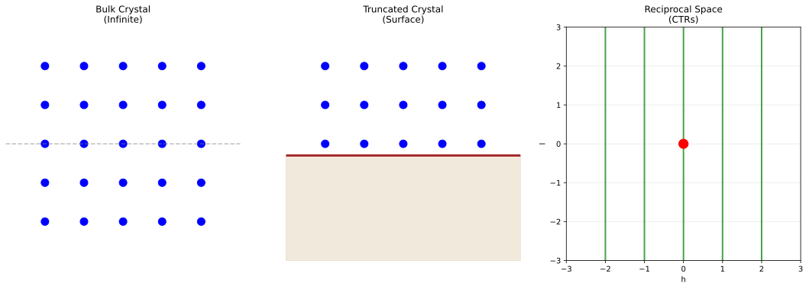
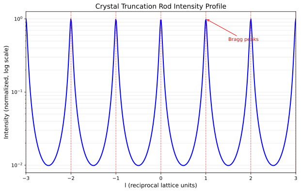
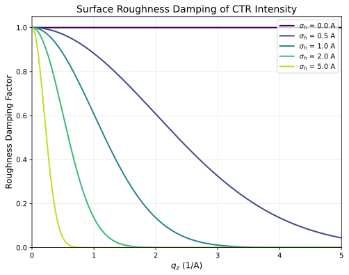
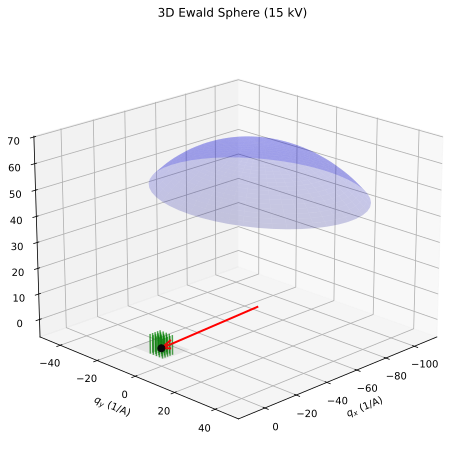

# Complete RHEED Simulation: From Ewald Sphere to CTR Rods

This guide provides a complete walkthrough of simulating RHEED patterns from first principles using the `ewald_simulator`. We use Si(111) as a concrete example to illustrate the physics at each step.

## Overview: Why Surface Diffraction is Different

In **bulk X-ray diffraction**, the crystal is periodic in all three dimensions, producing discrete Bragg peaks at reciprocal lattice points $(h, k, l)$ where all indices are integers.

In **RHEED (surface diffraction)**, the crystal is truncated at the surface:
- Periodicity is preserved **in-plane** (x, y directions)
- Periodicity is **broken** along the surface normal (z direction)

This truncation transforms discrete Bragg peaks into **continuous rods** of intensity extending perpendicular to the surface—the **Crystal Truncation Rods (CTRs)**.

**Visualizing bulk vs surface reciprocal space:**

```python
import matplotlib.pyplot as plt

fig, axes = plt.subplots(1, 2, figsize=(12, 5))

# Left: Bulk diffraction (discrete points)
ax1 = axes[0]
for h in range(-2, 3):
    for l in range(-2, 3):
        ax1.scatter(h, l, c="blue", s=100)
ax1.set_xlabel("h", fontsize=12)
ax1.set_ylabel("l", fontsize=12)
ax1.set_title("Bulk Diffraction\n(Discrete Bragg peaks)", fontsize=14)
ax1.set_xlim(-3, 3)
ax1.set_ylim(-3, 3)
ax1.grid(True, alpha=0.3)

# Right: Surface diffraction (continuous rods)
ax2 = axes[1]
for h in range(-2, 3):
    ax2.axvline(h, color="green", linewidth=3, alpha=0.7)
ax2.set_xlabel("h", fontsize=12)
ax2.set_ylabel("l (continuous)", fontsize=12)
ax2.set_title("Surface Diffraction (RHEED)\n(Crystal Truncation Rods)", fontsize=14)
ax2.set_xlim(-3, 3)
ax2.set_ylim(-3, 3)
ax2.grid(True, alpha=0.3)

plt.tight_layout()
plt.savefig("bulk_vs_surface.png", dpi=150)
```



## The Physics Step by Step

### Step 1: Define the Crystal Structure

Si has a diamond cubic structure with lattice constant $a = 5.431$ Å. The conventional unit cell contains 8 atoms at positions:

| Atom | Fractional Coordinates |
|------|----------------------|
| 1 | (0.00, 0.00, 0.00) |
| 2 | (0.25, 0.25, 0.25) |
| 3 | (0.50, 0.50, 0.00) |
| 4 | (0.75, 0.75, 0.25) |
| 5 | (0.50, 0.00, 0.50) |
| 6 | (0.75, 0.25, 0.75) |
| 7 | (0.00, 0.50, 0.50) |
| 8 | (0.25, 0.75, 0.75) |

```python
import jax.numpy as jnp
import rheedium as rh
from rheedium.types import create_crystal_structure

# Si lattice constant
a_si = 5.431  # Angstroms

# Diamond structure fractional positions
frac_coords = jnp.array([
    [0.00, 0.00, 0.00],
    [0.25, 0.25, 0.25],
    [0.50, 0.50, 0.00],
    [0.75, 0.75, 0.25],
    [0.50, 0.00, 0.50],
    [0.75, 0.25, 0.75],
    [0.00, 0.50, 0.50],
    [0.25, 0.75, 0.75],
])

# Convert to Cartesian
cart_coords = frac_coords * a_si

# Si atomic number = 14
atomic_numbers = jnp.full(8, 14.0)

# Create crystal structure
si_crystal = create_crystal_structure(
    frac_positions=jnp.column_stack([frac_coords, atomic_numbers]),
    cart_positions=jnp.column_stack([cart_coords, atomic_numbers]),
    cell_lengths=jnp.array([a_si, a_si, a_si]),
    cell_angles=jnp.array([90.0, 90.0, 90.0]),
)
```

### Step 2: Construct the Reciprocal Lattice

For a cubic crystal with lattice constant $a$, the reciprocal lattice vectors are:

$$
\mathbf{a}^* = \frac{2\pi}{a}\hat{x}, \quad
\mathbf{b}^* = \frac{2\pi}{a}\hat{y}, \quad
\mathbf{c}^* = \frac{2\pi}{a}\hat{z}
$$

For Si with $a = 5.431$ Å:

$$
|\mathbf{a}^*| = |\mathbf{b}^*| = |\mathbf{c}^*| = \frac{2\pi}{5.431} = 1.157 \text{ Å}^{-1}
$$

Any reciprocal lattice vector is:

$$
\mathbf{G}_{hkl} = h\mathbf{a}^* + k\mathbf{b}^* + l\mathbf{c}^*
$$

### Step 3: Calculate the Electron Wavelength and Wavevector

For electrons accelerated through voltage $V$ (in kV), the relativistic de Broglie wavelength is:

$$
\lambda = \frac{12.2643}{\sqrt{V \times 10^3 \left(1 + 9.78476 \times 10^{-7} V \times 10^3\right)}} \text{ Å}
$$

For 20 kV electrons:

$$
\lambda = \frac{12.2643}{\sqrt{20000(1 + 0.01957)}} = 0.0859 \text{ Å}
$$

The wavevector magnitude is:

$$
|\mathbf{k}| = \frac{2\pi}{\lambda} = 73.2 \text{ Å}^{-1}
$$

This is **much larger** than the reciprocal lattice spacing (1.157 Å⁻¹), which is why the Ewald sphere is nearly flat in RHEED geometry.

### Step 4: Build the Incident Wavevector

The electron beam arrives at grazing angle $\theta$ (typically 1–5°) with azimuthal angle $\phi$:

$$
\mathbf{k}_{\text{in}} = |\mathbf{k}| \begin{pmatrix}
\cos\theta \cos\phi \\
\cos\theta \sin\phi \\
-\sin\theta
\end{pmatrix}
$$

For $\theta = 2°$, $\phi = 0°$, and $|\mathbf{k}| = 73.2$ Å⁻¹:

$$
\mathbf{k}_{\text{in}} = 73.2 \begin{pmatrix} 0.9994 \\ 0 \\ -0.0349 \end{pmatrix} = \begin{pmatrix} 73.16 \\ 0 \\ -2.55 \end{pmatrix} \text{ Å}^{-1}
$$

The negative z-component indicates the beam is traveling **downward** toward the surface.

### Step 5: Construct the Ewald Sphere

The Ewald sphere is a sphere in reciprocal space:

- **Center**: At the tip of $-\mathbf{k}_{\text{in}}$, i.e., at $(−73.16, 0, +2.55)$
- **Radius**: $|\mathbf{k}| = 73.2$ Å⁻¹

The diffraction condition is that the outgoing wavevector $\mathbf{k}_{\text{out}}$ must:

1. Start from the Ewald sphere center
2. End on a reciprocal lattice point (for bulk) or rod (for surface)
3. Have magnitude equal to $|\mathbf{k}_{\text{in}}|$ (elastic scattering)

**Visualizing the Ewald sphere construction:**

```python
from rheedium.plots import plot_ewald_sphere_2d
import matplotlib.pyplot as plt

# 2D cross-section of Ewald sphere with CTR rods
fig, ax = plt.subplots(figsize=(12, 8))
plot_ewald_sphere_2d(
    voltage_kv=20.0,       # 20 keV electrons
    theta_deg=2.0,         # 2° grazing angle
    lattice_spacing=5.431, # Si lattice constant
    n_rods=9,              # Show 9 rods
    ax=ax,
)
plt.savefig("ewald_construction.png", dpi=150)
```


The figure shows:
- **Blue curve**: Ewald sphere cross-section (radius = $|k| = 2\pi/\lambda$)
- **Green lines**: CTR rods at each $(h,0)$ position
- **Red arrow**: Incident wavevector $\mathbf{k}_{in}$ at grazing angle
- **Origin**: Where the beam "hits" in reciprocal space

### Step 6: Find CTR-Ewald Intersections

For each $(h, k)$ rod extending along the $\mathbf{c}^*$ direction, we solve for the $l$ value where the rod intersects the Ewald sphere.

The outgoing wavevector along the rod is:

$$
\mathbf{k}_{\text{out}}(l) = \mathbf{k}_{\text{in}} + h\mathbf{a}^* + k\mathbf{b}^* + l\mathbf{c}^*
$$

The elastic scattering condition $|\mathbf{k}_{\text{out}}| = |\mathbf{k}_{\text{in}}|$ gives:

$$
|\mathbf{k}_{\text{in}} + h\mathbf{a}^* + k\mathbf{b}^* + l\mathbf{c}^*|^2 = |\mathbf{k}_{\text{in}}|^2
$$

Expanding this quadratic in $l$:

$$
a l^2 + b l + c = 0
$$

where:

$$
\begin{align}
a &= |\mathbf{c}^*|^2 \\
b &= 2(\mathbf{k}_{\text{in}} + h\mathbf{a}^* + k\mathbf{b}^*) \cdot \mathbf{c}^* \\
c &= |\mathbf{k}_{\text{in}} + h\mathbf{a}^* + k\mathbf{b}^*|^2 - |\mathbf{k}_{\text{in}}|^2
\end{align}
$$

The solution is:

$$
l = \frac{-b \pm \sqrt{b^2 - 4ac}}{2a}
$$

**Physical constraints** on valid solutions:

1. **Real solution**: Discriminant $b^2 - 4ac \geq 0$ (rod actually intersects sphere)
2. **Upward scattering**: $k_{\text{out},z} > 0$ (beam scatters toward detector above sample)

The `find_ctr_ewald_intersection` function implements this:

```python
from rheedium.simul.simulator import find_ctr_ewald_intersection

# Example: Find intersection for (1,0) rod
l_intersect, k_out, valid = find_ctr_ewald_intersection(
    h=1,
    k=0,
    k_in=k_in,
    recip_a=recip_a,
    recip_b=recip_b,
    recip_c=recip_c,
)

if valid > 0.5:
    print(f"(1,0) rod intersects Ewald sphere at l = {l_intersect:.3f}")
    print(f"k_out = {k_out}")
```

### Step 7: Calculate Diffracted Intensities

At each valid intersection point $(h, k, l)$, the diffracted intensity includes:

#### Structure Factor

$$
F(\mathbf{G}) = \sum_j f_j(q) \exp(i \mathbf{G} \cdot \mathbf{r}_j)
$$

where:
- $f_j(q)$ = atomic form factor for atom $j$ at momentum transfer $q = |\mathbf{k}_{\text{out}} - \mathbf{k}_{\text{in}}|$
- $\mathbf{r}_j$ = position of atom $j$

Rheedium uses **Kirkland parameterization** for accurate electron form factors.

#### Debye-Waller Factor

Thermal vibrations reduce intensity:

$$
f_{\text{eff}}(q) = f(q) \times \exp\left(-\frac{B q^2}{16\pi^2}\right)
$$

where $B = 8\pi^2 \langle u^2 \rangle$ is the temperature factor.

#### CTR Modulation

The surface truncation creates intensity modulation along the rod:

$$
I_{\text{CTR}}(l) \propto \frac{1}{\sin^2(\pi l)}
$$

This diverges at integer $l$ (bulk Bragg peaks) and has minima at half-integer $l$ (anti-Bragg condition).

**Visualizing the CTR intensity profile:**

```python
from rheedium.plots import plot_ctr_profile
import matplotlib.pyplot as plt

fig, ax = plt.subplots(figsize=(10, 6))
plot_ctr_profile(l_range=(-2.0, 2.0), n_points=500, ax=ax)
plt.savefig("ctr_profile.png", dpi=150)
```



#### Surface Roughness Damping

RMS roughness $\sigma$ reduces intensity at high $q_z$:

$$
I_{\text{rough}} = I_{\text{ideal}} \times \exp(-\sigma^2 q_z^2)
$$

**Visualizing roughness effects:**

```python
from rheedium.plots import plot_roughness_damping
import matplotlib.pyplot as plt

fig, ax = plt.subplots(figsize=(8, 6))
plot_roughness_damping(
    q_z_range=(0.0, 5.0),
    sigma_values=[0.0, 0.5, 1.0, 2.0],
    ax=ax,
)
plt.savefig("roughness.png", dpi=150)
```



#### Total Intensity

$$
I(h, k, l) = |F(\mathbf{G})|^2 \times \frac{1}{\sin^2(\pi l) + \epsilon} \times \exp(-\sigma^2 q_z^2)
$$

where $\epsilon \approx 0.01$ regularizes the divergence at integer $l$.

### Step 8: Project onto Detector

The diffracted beams are projected onto a phosphor screen at distance $d$ from the sample:

$$
\begin{align}
x_{\text{det}} &= d \times \frac{k_{\text{out},y}}{k_{\text{out},x}} \\
y_{\text{det}} &= d \times \frac{k_{\text{out},z}}{k_{\text{out},x}}
\end{align}
$$

This ray-tracing projection maps each $\mathbf{k}_{\text{out}}$ to a point on the detector screen.

## Complete Example: Si(111) RHEED Simulation

```python
import jax.numpy as jnp
import rheedium as rh
from rheedium.simul import ewald_simulator
from rheedium.types import create_crystal_structure

# 1. Create Si(111) crystal structure
a_si = 5.431

frac_coords = jnp.array([
    [0.00, 0.00, 0.00],
    [0.25, 0.25, 0.25],
    [0.50, 0.50, 0.00],
    [0.75, 0.75, 0.25],
    [0.50, 0.00, 0.50],
    [0.75, 0.25, 0.75],
    [0.00, 0.50, 0.50],
    [0.25, 0.75, 0.75],
])

cart_coords = frac_coords * a_si
atomic_numbers = jnp.full(8, 14.0)

si_crystal = create_crystal_structure(
    frac_positions=jnp.column_stack([frac_coords, atomic_numbers]),
    cart_positions=jnp.column_stack([cart_coords, atomic_numbers]),
    cell_lengths=jnp.array([a_si, a_si, a_si]),
    cell_angles=jnp.array([90.0, 90.0, 90.0]),
)

# 2. Run the Ewald simulator
pattern = ewald_simulator(
    crystal=si_crystal,
    voltage_kv=20.0,           # 20 keV electrons
    theta_deg=2.0,             # 2° grazing incidence
    phi_deg=0.0,               # Beam along [100] azimuth
    hmax=5,                    # h indices from -5 to +5
    kmax=5,                    # k indices from -5 to +5
    detector_distance=1000.0,  # 1 meter to detector
    temperature=300.0,         # Room temperature
    surface_roughness=0.5,     # 0.5 Å RMS roughness
)

# 3. Analyze results
valid_mask = pattern.G_indices >= 0
n_valid = jnp.sum(valid_mask)

print(f"Found {n_valid} valid reflections")
print(f"Detector coordinates range:")
print(f"  x: [{pattern.detector_points[valid_mask, 0].min():.1f}, "
      f"{pattern.detector_points[valid_mask, 0].max():.1f}] mm")
print(f"  y: [{pattern.detector_points[valid_mask, 1].min():.1f}, "
      f"{pattern.detector_points[valid_mask, 1].max():.1f}] mm")

# 4. Visualize
rh.plots.plot_rheed(pattern, grid_size=400)
```

## Understanding the Output

The `ewald_simulator` returns a `RHEEDPattern` containing:

| Field | Description |
|-------|-------------|
| `G_indices` | Indices into the (h,k) grid; -1 for invalid |
| `k_out` | Outgoing wavevectors (N × 3) |
| `detector_points` | Screen coordinates (N × 2) in mm |
| `intensities` | Normalized intensities |

### What the Pattern Shows

The RHEED pattern for Si(111) at $\phi = 0°$ shows:

1. **Central specular streak** at $(h,k) = (0,0)$ — the direct beam reflection
2. **Symmetric streaks** at $(\pm 1, 0)$, $(\pm 2, 0)$, etc. — Laue zones
3. **Intensity modulation** along each streak — the CTR profile
4. **Streak broadening** — finite coherent domain size (if applicable)

## Key Physical Insights

### Why Rods Instead of Spots?

The 2D periodicity of the surface means reciprocal lattice "points" become "rods":

- **In-plane** (h, k): Still quantized by surface lattice
- **Out-of-plane** (l): Continuous due to broken periodicity

### Why Grazing Incidence?

At grazing angles:

1. **Surface sensitivity**: Electrons penetrate only a few atomic layers
2. **Large Ewald sphere curvature**: Sphere appears nearly flat at low $\theta$
3. **Streak visibility**: Tangent intersection with rods produces elongated features

### Why the CTR 1/sin²(πl) Modulation?

The sharp termination of the electron density at the surface creates a step function in real space. The Fourier transform of a step function is $1/q$, giving the characteristic $1/\sin^2(\pi l)$ intensity profile along the rod.

## Comparison with Bulk-Like Approaches

The older `kinematic_simulator` treated RHEED like bulk diffraction:

| Aspect | Bulk-like (old) | CTR-based (new) |
|--------|-----------------|-----------------|
| l values | Integer only | Continuous from Ewald geometry |
| Physics | 3D periodic crystal | Surface truncation |
| Intensity | Structure factor only | SF × CTR × roughness |
| Accuracy | Incorrect for surfaces | Physically correct |

## Visualizing the 3D Geometry

The full 3D picture shows the Ewald sphere intersecting multiple CTR rods:

```python
from rheedium.plots import plot_ewald_sphere_3d
import matplotlib.pyplot as plt

fig = plt.figure(figsize=(10, 8))
ax = fig.add_subplot(111, projection="3d")
plot_ewald_sphere_3d(
    voltage_kv=20.0,
    theta_deg=2.0,
    phi_deg=0.0,
    lattice_spacing=5.431,  # Si
    n_rods_h=5,
    n_rods_k=5,
    elev=20.0,
    azim=45.0,
    ax=ax,
)
plt.savefig("ewald_3d_si.png", dpi=150)
```



This 3D view shows:
- **Blue surface**: Ewald sphere (partial, upper hemisphere)
- **Green lines**: CTR rods forming a 2D grid, extending along $q_z$
- **Red arrow**: Incident wavevector at grazing angle
- **Gray plane**: Surface (z = 0)

## Advanced: Azimuthal Dependence

Rotating $\phi$ changes which in-plane periodicities the beam probes:

```python
# Scan azimuthal angle from 0° to 90°
for phi in [0, 15, 30, 45, 60, 75, 90]:
    pattern = ewald_simulator(
        crystal=si_crystal,
        voltage_kv=20.0,
        theta_deg=2.0,
        phi_deg=float(phi),
        hmax=5, kmax=5,
    )

    valid_count = jnp.sum(pattern.G_indices >= 0)
    print(f"phi = {phi}°: {valid_count} valid reflections")
```

Different azimuths reveal different symmetry elements:
- $\phi = 0°$ (along [100]): Shows 2-fold symmetry
- $\phi = 45°$ (along [110]): Different streak spacing
- $\phi = 90°$ (along [010]): Equivalent to 0° for cubic

## Summary

The `ewald_simulator` correctly implements RHEED physics by:

1. **Building the Ewald sphere** from beam voltage and geometry
2. **Solving the quadratic intersection** for each $(h, k)$ CTR rod
3. **Computing the continuous $l$ value** at each intersection
4. **Calculating intensities** with proper structure factors, CTR modulation, and roughness
5. **Projecting onto the detector** for visualization

This approach produces physically accurate RHEED patterns that correctly represent surface diffraction phenomena.

## Key Source Files

- [`simul/simulator.py`](../../src/rheedium/simul/simulator.py) — `ewald_simulator` and `find_ctr_ewald_intersection`
- [`simul/form_factors.py`](../../src/rheedium/simul/form_factors.py) — Kirkland atomic form factors
- [`simul/surface_rods.py`](../../src/rheedium/simul/surface_rods.py) — CTR intensity calculations
- [`simul/simul_utils.py`](../../src/rheedium/simul/simul_utils.py) — Wavelength and wavevector utilities
